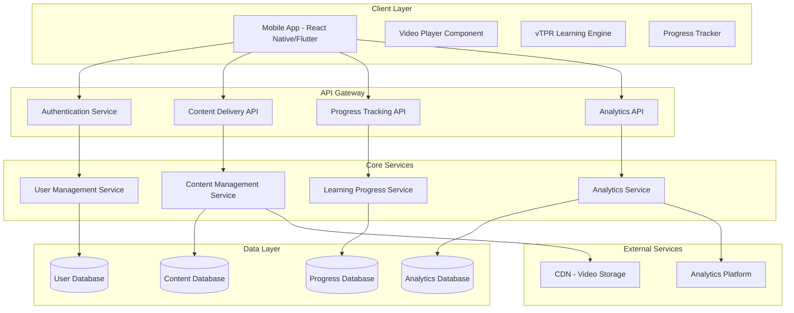
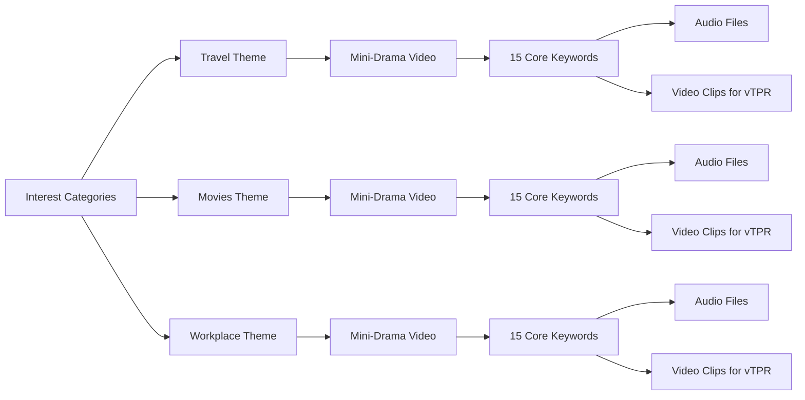

# Design Document

## Overview

SmarTalk MVP is designed as a scientifically-grounded language learning platform that leverages the "comprehensible input" methodology through interactive mini-dramas. The system architecture prioritizes delivering a seamless "first deadly contact" experience that converts skeptical users into believers within a single 30-minute session.

The design is built around four core scientific principles:
1. **Krashen's Input Hypothesis** - Language acquisition through comprehensible input (i+1) in low-anxiety environments
2. **Usage-Based Theory** - Grammar emerges naturally from meaningful language usage patterns
3. **Connectionism** - Learning strengthens neural connections through high-frequency, quality input
4. **Virtual Total Physical Response (vTPR)** - Digital implementation of TPR connecting audio directly to visual meaning

### Design Philosophy
- **De-academization**: Avoid traditional educational interface seriousness, create a relaxed entertainment atmosphere
- **Emotional Design**: Every interaction should convey encouragement and achievement
- **Intuitive Operation**: Reduce cognitive load, let users focus on content itself
- **Immersive Experience**: Create cinematic visual experience to enhance engagement

### Visual Design System

#### Color Palette
```
Primary Colors:
- Deep Blue #1A237E (trust, professionalism)
- Warm Orange #FF6B35 (energy, warmth, achievement)
- Soft White #FAFAFA (simplicity, purity)

Secondary Colors:
- Success Green #4CAF50 (correct feedback)
- Neutral Gray #757575 (text, borders)
- Gradient Background #E8F4FD → #F0F8FF (comfort)

Theme-specific Colors:
- Travel: Sky Blue #2196F3 + Sunset Orange #FF9800
- Movies: Deep Purple #673AB7 + Gold #FFC107
- Workplace: Business Blue #1976D2 + Silver #90A4AE
```

#### Typography System
```
Chinese Fonts:
- Headlines: PingFang SC Medium (16-28px)
- Body: PingFang SC Regular (14-16px)
- Supporting: PingFang SC Light (12-14px)

English Fonts:
- Headlines: SF Pro Display Semibold
- Body: SF Pro Text Regular
- Code/Labels: SF Mono Regular
```

#### Icon System
- Style: Rounded linear icons, 2px stroke width
- Sizes: 16px, 24px, 32px, 48px
- Colors: Monochrome or gradient fill
- Animation: Support micro-animation transitions

## Architecture

### High-Level System Architecture



### Content Architecture

The content system is designed around themed learning packages that support personalized user experiences:



## Components and Interfaces

### Core Components

#### 1. Onboarding Engine
**Purpose**: Build trust and manage user expectations while capturing interest preferences

**Key Interfaces**:
- `OnboardingFlow`: Manages the sequential presentation of trust-building content
- `InterestSelector`: Captures user preferences and routes to appropriate content packages
- `MethodologyPresenter`: Delivers animated explanations of the neural immersion method

**Data Flow**:
```typescript
interface OnboardingState {
  currentStep: number;
  selectedInterest: 'travel' | 'movies' | 'workplace';
  completedSteps: string[];
  userTrustLevel: number; // Derived from engagement metrics
}
```

#### 2. Content Delivery System
**Purpose**: Serve personalized mini-drama content with intelligent caching and preloading

**Key Interfaces**:
- `VideoPlayer`: Handles subtitle display, keyword highlighting, and theater mode
- `ContentManager`: Manages content fetching, caching, and quality adaptation
- `SubtitleEngine`: Renders dynamic subtitle highlighting for vocabulary emphasis

**Technical Specifications**:
- Video format: MP4 with H.264 encoding for broad compatibility
- Subtitle format: WebVTT with custom styling for keyword highlighting
- Adaptive bitrate streaming for optimal performance across devices
- Preloading strategy: Load next content during current video playback

#### 3. vTPR Learning Engine
**Purpose**: Implement the core "audio-visual matching" learning interaction with zero-punishment feedback

**Key Interfaces**:
- `AudioPlayer`: Delivers clear pronunciation audio for vocabulary items
- `VideoOptionSelector`: Presents 2-4 video clip choices with smooth animations
- `FeedbackSystem`: Provides positive reinforcement and encouraging micro-copy
- `ProgressTracker`: Maintains real-time progress visualization

**Interaction Design**:
```typescript
interface vTPRSession {
  keywordId: string;
  audioUrl: string;
  videoOptions: VideoClip[];
  correctOptionIndex: number;
  userAttempts: number;
  completionTime: number;
}

interface FeedbackResponse {
  isCorrect: boolean;
  encouragementMessage?: string;
  visualFeedback: 'highlight' | 'dim' | 'celebrate';
  audioFeedback: 'success' | 'neutral';
}
```

#### 4. Magic Moment Orchestrator
**Purpose**: Create the pivotal "subtitle-free comprehension" experience that drives user activation

**Key Features**:
- Ceremonial transition animations to build anticipation
- Full-screen theater mode with zero UI distractions
- Emotional achievement confirmation with empathetic copy
- Immediate transition to journey continuation hooks

**Success Metrics Integration**:
- Tracks completion rate of subtitle-free viewing
- Measures user self-assessment responses
- Triggers activation event for analytics pipeline

#### 5. Analytics and Optimization Engine
**Purpose**: Capture comprehensive user behavior data to optimize the conversion funnel

**Event Tracking Schema**:
```typescript
interface AnalyticsEvent {
  eventType: 'onboarding_step' | 'video_complete' | 'vtpr_attempt' | 'activation' | 'retention';
  userId: string;
  sessionId: string;
  timestamp: number;
  properties: {
    step?: string;
    interestCategory?: string;
    videoId?: string;
    keywordId?: string;
    attemptNumber?: number;
    isCorrect?: boolean;
    completionRate?: number;
  };
}
```

### API Design

#### Content API
```typescript
// GET /api/v1/content/interests
interface InterestOption {
  id: string;
  title: string;
  description: string;
  thumbnailUrl: string;
  previewVideoUrl: string;
}

// GET /api/v1/content/dramas/:interestId
interface DramaContent {
  id: string;
  title: string;
  subtitledVideoUrl: string;
  noSubtitlesVideoUrl: string;
  keywords: Keyword[];
  estimatedDuration: number;
}

// GET /api/v1/content/keywords/:dramaId
interface Keyword {
  id: string;
  word: string;
  audioUrl: string;
  videoClips: VideoClip[];
  subtitleTimestamp: { start: number; end: number };
}
```

#### Progress API
```typescript
// POST /api/v1/progress/keyword-complete
interface KeywordProgress {
  userId: string;
  keywordId: string;
  attempts: number;
  completionTime: number;
  timestamp: number;
}

// GET /api/v1/progress/user/:userId
interface UserProgress {
  currentDrama: string;
  completedKeywords: string[];
  totalKeywords: number;
  activationStatus: 'pending' | 'activated';
  lastActivity: number;
}
```

## Data Models

### User Data Model
```typescript
interface User {
  id: string;
  deviceId: string;
  createdAt: number;
  selectedInterest: string;
  onboardingCompleted: boolean;
  activationTimestamp?: number;
  lastActiveTimestamp: number;
  totalSessionTime: number;
}
```

### Content Data Model
```typescript
interface Drama {
  id: string;
  interestCategory: string;
  title: string;
  description: string;
  subtitledVideo: {
    url: string;
    duration: number;
    quality: string[];
  };
  noSubtitlesVideo: {
    url: string;
    duration: number;
    quality: string[];
  };
  keywords: string[]; // References to Keyword entities
  difficulty: 'beginner' | 'intermediate' | 'advanced';
}

interface Keyword {
  id: string;
  word: string;
  pronunciation: string;
  audioUrl: string;
  contextClues: string[];
  videoClips: VideoClip[];
  subtitleHighlight: {
    startTime: number;
    endTime: number;
    style: 'bounce' | 'glow' | 'pulse';
  };
}

interface VideoClip {
  id: string;
  url: string;
  thumbnailUrl: string;
  duration: number;
  isCorrectOption: boolean;
  contextDescription: string;
}
```

### Progress Data Model
```typescript
interface LearningSession {
  id: string;
  userId: string;
  dramaId: string;
  startTime: number;
  endTime?: number;
  keywordProgress: KeywordAttempt[];
  activationAchieved: boolean;
  selfAssessmentScore?: number;
}

interface KeywordAttempt {
  keywordId: string;
  attempts: number;
  correctOnFirstTry: boolean;
  totalTime: number;
  completedAt: number;
}
```

## Error Handling

### Client-Side Error Handling
1. **Network Connectivity Issues**
   - Implement offline mode with cached content
   - Graceful degradation when video fails to load
   - Retry mechanisms with exponential backoff

2. **Content Loading Failures**
   - Fallback to lower quality video streams
   - Alternative content suggestions if primary content unavailable
   - Clear user communication about temporary issues

3. **User Input Validation**
   - Real-time validation for all user interactions
   - Prevent invalid state transitions in learning flow
   - Graceful handling of rapid user interactions

### Server-Side Error Handling
1. **Content Delivery Failures**
   - CDN failover mechanisms
   - Content integrity verification
   - Automatic quality adaptation based on bandwidth

2. **Database Connection Issues**
   - Connection pooling and retry logic
   - Graceful degradation of non-critical features
   - Data consistency checks for progress tracking

3. **Analytics Pipeline Failures**
   - Event queuing for offline processing
   - Duplicate event detection and filtering
   - Critical vs. non-critical event prioritization

## Testing Strategy

### Unit Testing
- **Component Testing**: Each UI component tested in isolation with mock data
- **Service Testing**: API endpoints tested with comprehensive input validation
- **Logic Testing**: vTPR matching algorithm and progress calculation logic

### Integration Testing
- **User Flow Testing**: Complete onboarding to activation journey
- **Content Pipeline Testing**: End-to-end content delivery and playback
- **Analytics Integration**: Event tracking accuracy and data integrity

### Performance Testing
- **Load Testing**: Concurrent user scenarios up to 10,000 active users
- **Video Streaming**: Playback performance across different network conditions
- **Mobile Performance**: Battery usage and memory optimization

### User Experience Testing
- **A/B Testing Framework**: Compare different onboarding flows and content presentations
- **Usability Testing**: Task completion rates and user satisfaction metrics
- **Accessibility Testing**: Screen reader compatibility and motor accessibility

### Content Quality Assurance
- **Video Quality**: Consistent audio levels, clear visual content, proper encoding
- **Subtitle Accuracy**: Timing synchronization and keyword highlighting precision
- **Educational Effectiveness**: Vocabulary selection and difficulty progression validation

## Security and Privacy

### Data Protection
- **User Privacy**: Minimal data collection focused on learning optimization
- **Data Encryption**: All user data encrypted at rest and in transit
- **GDPR Compliance**: User consent management and data deletion capabilities

### Content Security
- **DRM Protection**: Video content protected against unauthorized distribution
- **API Security**: Rate limiting and authentication for all endpoints
- **Content Integrity**: Checksums and validation for all media assets

## Performance Optimization

### Client Performance
- **Lazy Loading**: Components and content loaded on-demand
- **Caching Strategy**: Intelligent caching of frequently accessed content
- **Bundle Optimization**: Code splitting and tree shaking for minimal app size

### Server Performance
- **CDN Strategy**: Global content distribution for minimal latency
- **Database Optimization**: Indexed queries and connection pooling
- **Caching Layers**: Redis caching for frequently accessed data

### Monitoring and Alerting
- **Real-time Monitoring**: Application performance and user experience metrics
- **Error Tracking**: Comprehensive error logging and alerting system
- **Business Metrics**: Activation rates and user engagement dashboards