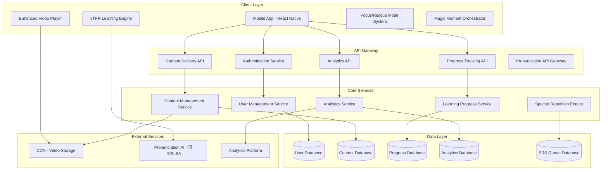
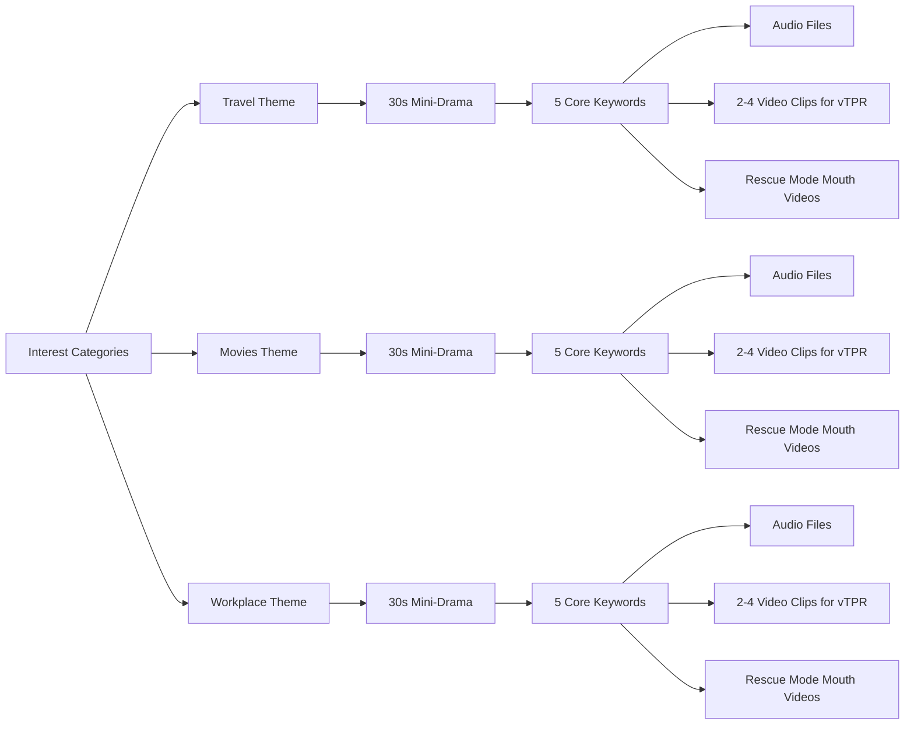

# Design Document

## Overview

SmarTalk V2 is designed as a scientifically-grounded language learning platform that implements the complete "First Deadly Contact" (首次致命接触) methodology through interactive mini-dramas. The system architecture prioritizes delivering a seamless 15-minute experience that converts skeptical users into believers through the transformative "magic moment" of subtitle-free comprehension.

The design is built around four core scientific principles from the Chinese requirements document:
1. **Krashen's Input Hypothesis** (克拉申假说) - Language acquisition through comprehensible input (i+1) in low-anxiety environments with reduced emotional filtering
2. **Usage-Based Theory** (用法论) - Grammar emerges naturally from meaningful language usage patterns through pattern discovery
3. **Connectionism** (联结主义) - Learning strengthens neural connections through high-frequency, quality input repetition
4. **Virtual Total Physical Response (vTPR)** - Digital implementation of TPR connecting audio directly to visual meaning through dynamic video

### Design Philosophy

Based on the comprehensive Chinese requirements document, the design follows these core principles:

- **De-academization** (去学术化): Avoid traditional educational interface seriousness, create a relaxed entertainment atmosphere using gamified language like "声音钥匙" instead of "vocabulary"
- **Emotional Design** (情感化设计): Every interaction conveys encouragement and achievement, with specific micro-copy like "你的大脑正在建立连接！"
- **Zero-Punishment Learning**: Implement Focus Mode and Rescue Mode to ensure users never get permanently stuck
- **Ceremonial Experience**: Create ritualistic transitions for the magic moment with proper build-up and emotional payoff
- **Neural Immersion Method**: Present the methodology as a scientific breakthrough rather than traditional language learning

### Visual Design System

#### Color Palette (From Requirements Document)
```
Primary Colors:
- Deep Blue #1A237E (trust, professionalism)
- Warm Orange #FF6B35 (energy, warmth, achievement)
- Soft White #FAFAFA (simplicity, purity)

Secondary Colors:
- Success Green #4CAF50 (correct feedback)
- Neutral Gray #757575 (text, borders)
- Gradient Background #E8F4FD → #F0F8FF (comfort)

Theme-specific Colors:
- Travel: Sky Blue #2196F3 + Sunset Orange #FF9800
- Movies: Deep Purple #673AB7 + Gold #FFC107
- Workplace: Business Blue #1976D2 + Silver #90A4AE
```

#### Typography System (From Requirements Document)
```
Chinese Fonts:
- Headlines: PingFang SC Medium (16-28px)
- Body: PingFang SC Regular (14-16px)
- Supporting: PingFang SC Light (12-14px)

English Fonts:
- Headlines: SF Pro Display Semibold
- Body: SF Pro Text Regular
- Code/Labels: SF Mono Regular
```

#### Micro-Copy and Messaging Strategy
Based on the Chinese requirements, all user-facing text must:
- Use encouraging language that builds confidence
- Avoid academic terminology in favor of gamified metaphors
- Provide emotional support during difficulty (Focus Mode: "别担心，放慢速度有助于大脑吸收")
- Create anticipation and excitement ("准备好见证奇迹了吗？")
- Emphasize the scientific nature of the approach without being intimidating

## Architecture

### High-Level System Architecture



### Content Architecture

The content system is designed around the specific requirements for themed learning packages with exactly 5 vocabulary items per mini-drama:



## Page Flow and State Management

### Complete User Journey Flow
Based on the Chinese requirements document, the complete page flow must include:

```
// Main Flow: New user first-time completion of first chapter (Happy Path)
[Splash Screen] → (auto-transition) → [Methodology Animation]
[Methodology Animation] → (complete/skip) → [Placement Test Choice]
[Placement Test Choice] → (click "开始测试") → [Placement Test]
[Placement Test] → (complete all questions) → [Test Results]
[Test Results] → (click "开启故事") → [Learning Map]
[Learning Map] → (click first chapter) → [Story Preview/Trailer]
[Story Preview] → (watch complete) → [Core Learning Screen]

// Core Learning Loop
[Core Learning - Context Guessing] → (select correct video) → [Core Learning - Pronunciation]
[Core Learning - Pronunciation] → (score >85) → [Success Feedback Overlay]
[Success Feedback Overlay] → (auto-close) → [Core Learning - Context Guessing] // Next keyword

// Magic Moment Flow
[Core Learning] → (last keyword completed) → [Milestone Achievement Overlay]
[Milestone Achievement] → (click "见证奇迹") → [Theater Mode]
[Theater Mode] → (video complete) → [Achievement Feedback]
[Achievement Feedback] → (click "完成") → [Learning Map] // Chapter marked complete, next unlocked

// Error Recovery Branches
[Context Guessing] → (2nd consecutive error) → [Focus Mode Overlay] → [Context Guessing - Guided]
[Pronunciation] → (3rd consecutive failure) → [Rescue Mode Overlay] → [Pronunciation - Final Attempt]

// Support Module Access
[Learning Map] → (click profile) → [Personal Center] → [Achievement Wall/Statistics/Settings]
```

### State Management Architecture
```typescript
interface AppState {
  user: UserState;
  learning: LearningState;
  content: ContentState;
  ui: UIState;
}

interface UserState {
  isFirstLaunch: boolean;
  onboardingCompleted: boolean;
  selectedTheme: 'travel' | 'movies' | 'workplace' | null;
  cefrLevel: 'A1' | 'A2' | 'B1' | 'B2' | 'C1' | 'C2' | null;
  placementTestCompleted: boolean;
  currentChapter: string | null;
  activationAchieved: boolean;
  aquaPoints: number;
  badges: Badge[];
}

interface LearningState {
  currentKeyword: string | null;
  keywordProgress: {
    [keywordId: string]: {
      contextGuessAttempts: number;
      pronunciationAttempts: number;
      completed: boolean;
      usedFocusMode: boolean;
      usedRescueMode: boolean;
    };
  };
  chapterProgress: {
    [chapterId: string]: {
      status: 'locked' | 'unlocked' | 'in_progress' | 'completed';
      completedKeywords: string[];
      totalKeywords: number;
    };
  };
  srsQueue: SRSItem[];
}
```

## Components and Interfaces

### Core Components

#### 1. Onboarding and Methodology Engine
**Purpose**: Build trust and manage user expectations while presenting the "neural immersion method" as a scientific breakthrough

**Key Interfaces**:
- `SplashScreen`: Displays tagline "Don't learn a language, live a story"
- `MethodologyPresenter`: 3-page animated sequence explaining the approach
- `InterestSelector`: Theme selection with visual cards and theme-specific styling
- `PlacementTestEngine`: Optional 3-minute assessment with CEFR results

**Detailed Implementation Requirements**:

1. **First Launch Detection**: System must track `is_first_launch = true` locally and force methodology flow
2. **Methodology Animation Pages** (3 pages, auto-play, skippable):
   - Page 1: Pain point resonance - "学了10年，还是开不了口？"
   - Page 2: Solution explanation - "我们不背单词，我们经历故事。" with animation showing gray person becoming colorful through stories
   - Page 3: Promise setting - "准备好，你的第一个故事即将开始。"
3. **Placement Test Flow**:
   - Guide page: "花3分钟，找到你的故事起点？" with [开始测试] [跳过，从新手开始] buttons
   - Test content: 3 "listen-and-choose-image" + 2 "read-aloud" tasks
   - Results page: CEFR level (e.g., A2), ability radar chart (pronunciation, listening, vocabulary), recommendation text
4. **Skip Functionality**: Clear but not prominent skip buttons, default to A1 level if skipped
5. **Trust Building**: Clean interface, clear instructions, immediate progression to learning map

**Methodology Presentation Flow**:
```typescript
interface MethodologyStep {
  id: number;
  title: string;
  content: string;
  animation: 'pain-point' | 'solution' | 'promise';
  canSkip: boolean;
}

const methodologySteps: MethodologyStep[] = [
  {
    id: 1,
    title: "痛点共鸣",
    content: "学了10年，还是开不了口？",
    animation: 'pain-point',
    canSkip: true
  },
  {
    id: 2,
    title: "解决方案",
    content: "我们不背单词，我们经历故事。",
    animation: 'solution',
    canSkip: true
  },
  {
    id: 3,
    title: "承诺前置",
    content: "准备好，你的第一个故事即将开始。",
    animation: 'promise',
    canSkip: true
  }
];
```

#### 2. Content Delivery and Video System
**Purpose**: Serve themed mini-drama content with intelligent caching and the dual-video system (subtitled/non-subtitled)

**Key Interfaces**:
- `EnhancedVideoPlayer`: Handles both teaser (with subtitles) and magic moment (without subtitles) modes
- `SubtitleEngine`: Renders dynamic subtitle highlighting for the 5 core vocabulary words
- `TheaterModeController`: Manages full-screen, zero-UI distraction playback
- `ContentPreloader`: Intelligent preloading of next content during current video playback

**Video System Architecture**:
```typescript
interface MiniDrama {
  id: string;
  theme: 'travel' | 'movies' | 'workplace';
  title: string;
  duration: 30; // Fixed 30 seconds
  subtitledVideoUrl: string;
  noSubtitlesVideoUrl: string;
  keywords: Keyword[];
  themeColors: {
    primary: string;
    secondary: string;
  };
}

interface Keyword {
  id: string;
  word: string;
  pronunciation: string;
  audioUrl: string;
  videoClips: VideoClip[]; // 2-4 clips from same drama
  rescueMouthVideo: string; // Slow-motion articulation
  subtitleHighlight: {
    startTime: number;
    endTime: number;
    effect: 'bounce' | 'glow' | 'pulse';
  };
}
```

#### 3. vTPR Learning Engine with Error Recovery
**Purpose**: Implement the core "audio-visual matching" learning interaction with sophisticated error handling

**Key Interfaces**:
- `AudioPlayer`: Delivers clear pronunciation audio with repeat functionality
- `VideoOptionSelector`: Presents 2-4 video clip choices with smooth animations
- `FocusModeController`: Triggers after 2 consecutive errors with supportive overlay
- `RescueModeController`: Triggers after 3 pronunciation failures with mouth articulation videos
- `ProgressTracker`: Maintains real-time "声音钥匙 X/5" visualization

**Detailed Implementation Requirements**:

1. **Context Guessing (情景猜义) Interface**:
   - Top: Progress indicator "声音钥匙 3/5"
   - Middle: 3 video/animation options (3-5 seconds each, looping)
   - Bottom: Audio playback controls
   - Positive feedback: Selected option enlarges, "bingo" sound effect, progress bar advances
   - Negative feedback: Option shakes slightly and grays out, shows "再想想？"

2. **Focus Mode (专注模式) Trigger**:
   - Activates after 2 consecutive wrong selections (`selection_attempts >= 2`)
   - Semi-transparent overlay with title "进入专注模式"
   - Message: "别担心，放慢速度有助于大脑吸收"
   - Correct option glows/highlights, audio plays at 0.8x speed
   - Encouraging tone, no blame language

3. **Echo & Polish (回声与润色) Interface**:
   - Display word/phrase to repeat
   - Large "按住说话" (hold to speak) recording button
   - Success (>85 score): Progress bar fill animation, "Perfect!" + "+10 Aqua-Points"
   - Moderate (<85 score): Show score with specific phonetic feedback (e.g., "t的发音要更轻哦")
   - Optional: Expandable waveform comparison view

4. **Rescue Mode (救援模式) Trigger**:
   - Activates after 3 consecutive pronunciation failures (`pronunciation_attempts >= 3`)
   - Modal overlay with native speaker mouth close-up slow-motion video
   - Optional phonetic technique breakdown below video
   - Final attempt required, but force pass regardless of score
   - Reduced/zero Aqua-Points reward for rescue mode completion

**Error Recovery System**:
```typescript
interface LearningState {
  keywordId: string;
  contextGuessAttempts: number;
  pronunciationAttempts: number;
  currentMode: 'normal' | 'focus' | 'rescue';
  canProceed: boolean;
}

interface FocusMode {
  trigger: 'consecutive_context_errors';
  threshold: 2;
  overlay: {
    message: "别担心，放慢速度有助于大脑吸收";
    audioSpeed: 0.8;
    visualCues: 'highlight_correct_option';
  };
}

interface RescueMode {
  trigger: 'consecutive_pronunciation_failures';
  threshold: 3;
  content: {
    mouthVideo: string; // Slow-motion native speaker
    phoneticBreakdown?: string;
    finalAttemptRequired: true;
    forcePassAfterAttempt: true;
    reducedReward: true;
  };
}
```

#### 4. Magic Moment Orchestrator
**Purpose**: Create the pivotal "subtitle-free comprehension" experience with proper ceremonial build-up

**Key Features**:
- Milestone achievement page with golden particle effects
- Ceremonial transition with "戴上耳机，见证奇迹" CTA
- Full-screen theater mode with zero UI distractions
- Emotional achievement confirmation with empathetic self-assessment
- Beautiful virtual badge awarding system

#### 4.1 Ritual and Pacing Design
**Purpose**: To amplify the emotional impact of the "magic moment" by carefully controlling the pacing, visual, and auditory cues, transforming a simple video playback into a deeply personal achievement ceremony.

**Implementation Details**:

1. **The Build-Up (蓄势)**:
   - After the `Milestone Achievement` overlay, there will be a **3-second mandatory pause** where the screen fades to black
   - During the fade, a subtle, uplifting sound effect (like a soft chime or synth pad swell) will play
   - The CTA "戴上耳机，见证奇迹" is not just a button text; it's a critical instruction. The app should detect if headphones are plugged in. If not, a gentle, non-blocking prompt appears: "为获得最佳体验，建议使用耳机。" (For the best experience, headphones are recommended.)

2. **The Reveal (揭晓)**:
   - The `TheaterModeController` will not just remove UI; it will apply a slight "vignette" effect (darkened edges) to focus the user's attention on the video
   - The video will start playing **automatically** after the black screen transition, creating a seamless flow from anticipation to immersion

3. **The Afterglow (回味)**:
   - After the video ends, the screen will **hold on the final frame** for 2 seconds before transitioning to the `SelfAssessment` feedback page. This allows the user's brain to process the achievement ("I understood that!") before being asked about it
   - The `SelfAssessment` options should appear with a soft fade-in animation, not an abrupt pop-up. The background music from the "Build-Up" phase can gently return here

**Magic Moment Flow**:
```typescript
interface MagicMomentExperience {
  milestoneAchievement: {
    animation: 'golden_particles';
    message: "恭喜！你已集齐所有钥匙。准备好见证奇迹了吗？";
    ctaButton: "戴上耳机，见证奇迹";
  };
  theaterMode: {
    fullScreen: true;
    uiElements: 'none';
    videoSource: 'no_subtitles_version';
    duration: 30;
  };
  selfAssessment: {
    question: "感觉怎么样？";
    options: [
      { emoji: "🤯", text: "完全听懂了！", value: "complete" },
      { emoji: "😲", text: "比我想象的听懂更多！", value: "better_than_expected" },
      { emoji: "🙂", text: "听懂了一部分", value: "partial" }
    ];
    allResponsesPositive: true;
  };
  badgeAwarding: {
    travel: "旅行生存家";
    movies: "电影达人";
    workplace: "职场精英";
  };
}
```

#### 5. Pronunciation Assessment System
**Purpose**: Provide instant, actionable feedback on pronunciation with sophisticated error recovery

**Key Interfaces**:
- `PronunciationAPI`: Integration with 讯飞/ELSA for multi-dimensional assessment
- `FeedbackGenerator`: Maps API responses to encouraging Chinese feedback
- `ScoreVisualizer`: Displays scores with appropriate animations and rewards
- `AquaPointsSystem`: Manages the gamified reward system

**Pronunciation Assessment Flow**:
```typescript
interface PronunciationAssessment {
  apiProvider: '讯飞' | 'ELSA';
  dimensions: ['accuracy', 'fluency', 'completeness'];
  responseTime: '<1.5s';
  loadingMessage: "分析中...";
  
  scoring: {
    excellent: {
      threshold: '>85';
      feedback: "Perfect!";
      reward: 10; // Full Aqua-Points
      animation: 'celebration';
    };
    moderate: {
      threshold: '<85';
      feedback: string; // Mapped from phonetic errors
      reward: 5; // Partial points
      retryAllowed: true;
    };
    rescue: {
      trigger: 'third_consecutive_failure';
      reward: 0; // No points but can proceed
      forcePass: true;
    };
  };
}

interface FeedbackMapping {
  phoneticError: string;
  chineseFeedback: string;
}

const feedbackMappings: FeedbackMapping[] = [
  { phoneticError: 't_sound_hard', chineseFeedback: 't的发音要更轻哦' },
  { phoneticError: 'th_sound_missing', chineseFeedback: '舌头要伸出来一点点' },
  // ... more mappings
];
```

#### 6. Learning Map and Progress System
**Purpose**: Visualize user journey with chapter progression and achievement tracking

**Key Features**:
- Visual chapter cards with completion states
- Unlock animations for new chapters
- Achievement wall with beautiful badge collection
- Integration with spaced repetition system
- Speaking tips integration with practical phrases

**Detailed Implementation Requirements**:

1. **Learning Map Interface**:
   - Central hub showing story chapters with visual cards
   - Chapter states: locked, unlocked (可开始), in_progress (带进度), completed (已通关)
   - Completed chapters marked with completion badges
   - Next chapter unlock animation with intriguing thumbnail and title
   - Profile entry point for accessing personal center

2. **Achievement System**:
   - Beautiful virtual badges for each theme: "旅行生存家" (travel), "电影达人" (movies), "职场精英" (workplace)
   - Achievement wall in profile showing badge collection
   - Badge awarding ceremony after magic moment completion
   - Visual badge design must be collectible and shareable

3. **Speaking Tips Integration**:
   - Clickable lightbulb icon for practical conversation advice
   - Emergency phrases: "Sorry, I mean..." (不好意思，我的意思是...), "How do you say... in English?" (用英语怎么说...?)
   - Emphasis on communication over perfection
   - Tips contextually relevant to user's learning progress

4. **Profile and Statistics**:
   - Personal information and CEFR level display
   - Key statistics: total learning time, words mastered, learning calendar heatmap
   - Achievement wall with earned badges
   - Settings access for account management, notifications, about/feedback

**Learning Map Design**:
```typescript
interface LearningMap {
  chapters: Chapter[];
  userProgress: UserProgress;
  achievementWall: Badge[];
  speakingTips: SpeakingTip[];
}

interface Chapter {
  id: string;
  title: string;
  theme: 'travel' | 'movies' | 'workplace';
  status: 'locked' | 'unlocked' | 'in_progress' | 'completed';
  thumbnail: string;
  suspenseTitle: string; // For locked chapters
  completionBadge?: Badge;
}

interface SpeakingTip {
  category: 'emergency_phrases' | 'conversation_starters' | 'clarification';
  phrases: {
    english: string;
    chinese: string;
    context: string;
  }[];
}

const emergencyPhrases = [
  {
    english: "Sorry, I mean...",
    chinese: "不好意思，我的意思是...",
    context: "When you need to correct yourself"
  },
  {
    english: "How do you say... in English?",
    chinese: "用英语怎么说...?",
    context: "When you're missing a word"
  }
];
```

## Data Models

### Enhanced User Data Model
```typescript
interface User {
  id: string;
  deviceId: string; // Anonymous identification
  createdAt: number;
  selectedInterest: 'travel' | 'movies' | 'workplace';
  cefr_level?: 'A1' | 'A2' | 'B1' | 'B2' | 'C1' | 'C2';
  placementTestCompleted: boolean;
  onboardingCompleted: boolean;
  activationTimestamp?: number; // Magic moment completion
  lastActiveTimestamp: number;
  totalSessionTime: number;
  aquaPoints: number; // Gamification currency
  badges: Badge[];
  preferences: {
    audioSpeed: number;
    skipMethodology: boolean;
    reminderSettings: NotificationSettings;
  };
}
```

### Content Data Model with Theme Support
```typescript
interface Drama {
  id: string;
  theme: 'travel' | 'movies' | 'workplace';
  title: string;
  description: string;
  chapterNumber: number;
  
  videos: {
    subtitled: {
      url: string;
      duration: 30;
      quality: string[];
    };
    noSubtitles: {
      url: string;
      duration: 30;
      quality: string[];
    };
  };
  
  keywords: string[]; // Exactly 5 references
  themeColors: {
    primary: string;
    secondary: string;
  };
  
  suspenseElements: {
    lockedTitle: string;
    thumbnail: string;
    teaser: string;
  };
}

interface Keyword {
  id: string;
  word: string;
  pronunciation: string;
  audioUrl: string;
  contextClues: string[];
  
  videoClips: VideoClip[]; // 2-4 clips from same drama
  rescueContent: {
    mouthVideoUrl: string;
    phoneticTips?: string[];
    articulationGuide?: string;
  };
  
  subtitleHighlight: {
    startTime: number;
    endTime: number;
    style: 'bounce' | 'glow' | 'pulse';
  };
  
  srsData: {
    nextReviewDate: number;
    interval: number;
    easeFactor: number;
    reviewCount: number;
  };
}
```

### Analytics and Progress Data Model
```typescript
interface LearningSession {
  id: string;
  userId: string;
  dramaId: string;
  startTime: number;
  endTime?: number;
  
  keywordProgress: KeywordAttempt[];
  activationAchieved: boolean;
  magicMomentFeedback?: 'complete' | 'better_than_expected' | 'partial';
  
  errorRecoveryEvents: {
    focusModeTriggered: number;
    rescueModeTriggered: number;
    totalRecoveries: number;
  };
  
  performanceMetrics: {
    videoLoadTime: number;
    pronunciationApiResponseTime: number[];
    screenTransitionTimes: number[];
  };
}

interface KeywordAttempt {
  keywordId: string;
  contextGuessAttempts: number;
  pronunciationAttempts: number;
  correctOnFirstTry: boolean;
  usedFocusMode: boolean;
  usedRescueMode: boolean;
  finalScore: number;
  aquaPointsEarned: number;
  totalTime: number;
  completedAt: number;
}

interface AnalyticsEvent {
  eventType: 'onboarding_step' | 'theme_selected' | 'video_complete' | 
            'keyword_attempt' | 'focus_mode_triggered' | 'rescue_mode_triggered' |
            'magic_moment_complete' | 'badge_earned' | 'retention_check';
  userId: string;
  sessionId: string;
  timestamp: number;
  properties: {
    step?: string;
    theme?: string;
    keywordId?: string;
    attemptNumber?: number;
    isCorrect?: boolean;
    mode?: 'normal' | 'focus' | 'rescue';
    score?: number;
    feedback?: string;
  };
}
```

## Error Handling and Recovery Systems

### Focus Mode Implementation
```typescript
class FocusModeController {
  private triggerThreshold = 2;
  
  shouldTrigger(attempts: number): boolean {
    return attempts >= this.triggerThreshold;
  }
  
  createOverlay(): FocusModeOverlay {
    return {
      type: 'semi_transparent',
      message: "别担心，放慢速度有助于大脑吸收",
      audioSpeed: 0.8,
      visualCues: {
        highlightCorrectOption: true,
        dimIncorrectOptions: true,
        addGlowEffect: true
      },
      encouragement: "你的大脑正在建立连接！"
    };
  }
}
```

### Rescue Mode Implementation
```typescript
class RescueModeController {
  private triggerThreshold = 3;
  
  shouldTrigger(pronunciationAttempts: number): boolean {
    return pronunciationAttempts >= this.triggerThreshold;
  }
  
  createRescueExperience(keywordId: string): RescueExperience {
    return {
      overlay: {
        type: 'modal',
        title: "让我们一起来看看正确的发音",
        canDismiss: false
      },
      content: {
        mouthVideo: this.getMouthVideo(keywordId),
        playbackSpeed: 0.5, // Slow motion
        phoneticBreakdown: this.getPhoneticTips(keywordId),
        encouragement: "看完视频后，再试一次就可以了"
      },
      finalAttempt: {
        required: true,
        forcePass: true,
        reducedReward: true,
        successMessage: "很好！继续下一个词汇"
      }
    };
  }
}
```

## Performance Optimization

### Client Performance Requirements
Based on the Chinese requirements document, the system must meet these specific performance targets:

```typescript
interface PerformanceTargets {
  appStartup: '<2s'; // 应用启动时间
  videoLoading: '<1s'; // 视频加载时间
  interactionResponse: '<100ms'; // 交互响应时间
  screenTransitions: '<300ms'; // 页面切换时间
  pronunciationApiResponse: '<1.5s'; // 发音评测API响应时间，期间显示"分析中..."
}

interface ContentRequirements {
  miniDramaDuration: 30; // Fixed 30 seconds per drama
  keywordsPerDrama: 5; // Exactly 5 core vocabulary items
  videoClipsPerKeyword: '2-4'; // 2-4 video clips from same drama for vTPR
  videoClipDuration: '3-5s'; // Each clip 3-5 seconds, looping
  rescueVideoRequired: true; // Slow-motion mouth articulation for each keyword
  audioQuality: 'clear_pronunciation'; // High-quality audio for each keyword
  subtitleHighlighting: ['bounce', 'glow', 'pulse']; // Visual effects for keyword highlighting
}

class PerformanceOptimizer {
  // Intelligent preloading strategy
  preloadNextContent(currentKeywordIndex: number, totalKeywords: number): void {
    if (currentKeywordIndex < totalKeywords - 1) {
      // Preload next keyword's audio and video clips
      this.preloadKeywordAssets(currentKeywordIndex + 1);
    } else {
      // Preload magic moment video (no subtitles version)
      this.preloadMagicMomentVideo();
    }
  }
  
  // CDN optimization for global delivery
  optimizeContentDelivery(): CDNStrategy {
    return {
      videoCompression: 'H.264_optimized',
      adaptiveBitrate: true,
      globalEdgeLocations: true,
      intelligentCaching: {
        audioFiles: '24h',
        videoClips: '12h',
        rescueVideos: '48h'
      }
    };
  }
  
  // Error recovery performance
  errorRecoveryTargets(): ErrorRecoveryMetrics {
    return {
      focusModeActivation: '<500ms', // Focus mode overlay appearance
      rescueModeVideoLoad: '<2s', // Rescue mode mouth video loading
      feedbackDisplayTime: '<300ms', // Pronunciation feedback display
      progressUpdateTime: '<100ms', // "声音钥匙 X/5" progress update
    };
  }
}
```

### Technical Architecture Requirements

```typescript
interface TechnicalRequirements {
  // Content Management
  contentStructure: {
    themes: ['travel', 'movies', 'workplace'];
    chaptersPerTheme: 'minimum_2'; // For unlock experience
    assetsPerKeyword: {
      audioFile: 'required';
      videoClips: '2-4_from_same_drama';
      rescueVideo: 'slow_motion_mouth';
      subtitleData: 'timing_and_effects';
    };
  };
  
  // API Integration
  pronunciationAPI: {
    providers: ['讯飞', 'ELSA'];
    dimensions: ['accuracy', 'fluency', 'completeness'];
    responseTime: '<1.5s';
    errorMapping: 'phonetic_to_chinese_feedback';
  };
  
  // Data Storage
  userIdentification: 'device_based_anonymous';
  progressPersistence: 'local_with_cloud_sync_ready';
  analyticsStorage: 'event_based_with_batch_processing';
  
  // Gamification System
  rewards: {
    currency: 'Aqua-Points';
    fullReward: 10; // For >85 pronunciation score
    partialReward: 5; // For moderate performance
    rescueReward: 0; // For rescue mode completion
  };
  
  // Error Recovery Thresholds
  errorThresholds: {
    focusMode: 2; // Consecutive context guessing errors
    rescueMode: 3; // Consecutive pronunciation failures
    forcePass: true; // Always allow progression after rescue mode
  };
}
```

### Caching Strategy
```typescript
interface CachingStrategy {
  immediate: string[]; // Load on app start
  onDemand: string[]; // Load when needed
  preload: string[]; // Load during current activity
  
  priorities: {
    high: ['current_keyword_audio', 'current_video_clips'];
    medium: ['next_keyword_assets', 'rescue_mode_videos'];
    low: ['future_chapter_previews', 'badge_animations'];
  };
}
```

## Testing Strategy

### User Experience Testing
Based on the requirements for validating the "magic moment" effectiveness:

```typescript
interface MagicMomentValidation {
  metrics: {
    completionRate: number; // Target: >30%
    emotionalImpact: 'complete' | 'better_than_expected' | 'partial';
    timeToCompletion: number; // Target: <15 minutes
    retentionAfterMagicMoment: number; // Target: >40% next-day
  };
  
  testScenarios: [
    'first_time_user_complete_journey',
    'user_with_focus_mode_usage',
    'user_with_rescue_mode_usage',
    'user_skipping_placement_test',
    'user_completing_placement_test'
  ];
}
```

### Performance Testing
```typescript
interface PerformanceTestSuite {
  loadTesting: {
    concurrentUsers: 10000;
    videoStreamingLoad: 'peak_usage_simulation';
    pronunciationApiLoad: 'batch_assessment_simulation';
  };
  
  deviceTesting: {
    lowEndDevices: ['iPhone_6', 'Android_API_21'];
    networkConditions: ['3G', '4G', 'WiFi', 'poor_connection'];
    batteryImpact: 'minimal_drain_requirement';
  };
}
```

## Security and Privacy

### Data Protection Strategy
```typescript
interface PrivacyCompliance {
  userIdentification: 'device_based_anonymous';
  dataCollection: 'minimal_learning_optimization_only';
  dataRetention: {
    learningProgress: 'indefinite_with_user_control';
    analyticsEvents: '2_years_aggregated';
    audioRecordings: 'processed_immediately_not_stored';
  };
  
  gdprCompliance: {
    consentManagement: true;
    dataExport: true;
    dataDelection: true;
    transparentProcessing: true;
  };
}
```

## 7. Spaced Repetition System (SRS) Integration

**Purpose**: To convert short-term learning achievements into long-term memory, driving user retention and solidifying the learning effect, as specified in the PRD's business flow (B19).

### SRS Triggering and Data Flow

1. **Entry into SRS Queue**: A keyword is added to the user's SRS queue (`srsData`) only after the user successfully completes the **Magic Moment** for the chapter containing that keyword. This ensures only truly "acquired" words are scheduled for review.
2. **Initial Review Interval**: The first review for a newly acquired batch of 5 keywords is scheduled for **T+24 hours**.
3. **Data Model Update**: The `Keyword` data model's `srsData` field must be updated after each review.

### User Interface and Experience

The SRS will manifest in two primary ways in the MVP:

#### 7.1 Daily Review Prompt
**Purpose**: Gently nudge the user to engage with review content without disrupting the main flow of exploring new stories.

**Interface**:
- **On Learning Map**: A subtle, non-intrusive UI element will appear on the `Learning Map` screen if there are items due for review. E.g., a small, glowing "复习" (Review) button or an animated character tapping a stack of cards.
- **Micro-Copy**: "今天有 [5] 个记忆需要加固哦！" (You have [5] memories to reinforce today!)

#### 7.2 The Review Session Interface
**Purpose**: A fast-paced, low-friction interface distinct from the primary learning engine, designed for quick recall testing.

**Flow**:
1. User clicks the review prompt.
2. The system presents a card for a due keyword.
3. **Phase 1: Audio -> Meaning**: The audio for the keyword plays. The user is shown 2-3 static images (one correct, others are distractors from the same theme). This is a simplified vTPR.
4. **Phase 2: Self-Assessment**: After selecting the correct image, the user is asked to self-assess their recall speed: `[😎 秒懂 (Instantly Got It)]`, `[🤔 想了一下 (Had to Think)]`, `[🤯 忘了 (Forgot)]`.
5. **Algorithm**: The SRS algorithm (e.g., a simplified SM-2) uses this self-assessment to calculate the next review interval.
   - `Instantly Got It` -> Interval * 2.5
   - `Had to Think` -> Interval * 1.5
   - `Forgot` -> Interval reset to 24 hours.

**Design Philosophy**: The review process must be fast, taking less than 2 minutes for 5-10 words. It's a "snack," not a "meal."

## 8. Non-Functional Requirements

### 8.1 Accessibility (a11y)
**Purpose**: To ensure SmarTalk is usable by the widest possible audience, including those with disabilities.

**MVP Requirements**:
- **Color Contrast**: All text and meaningful UI elements must meet WCAG 2.1 AA contrast ratios against their background. The selected color palette must be double-checked.
- **Dynamic Type**: All text must respect the user's OS-level font size settings.
- **Screen Reader Support**: All interactive elements (buttons, inputs) must have descriptive labels for screen readers (e.g., VoiceOver, TalkBack). For visual elements like video clips, provide a text alternative.
- **Reduced Motion**: All non-essential animations (e.g., particle effects, parallax) must be disabled if the user has enabled "Reduce Motion" in their OS settings.

### 8.2 Internationalization (i18n) and Localization (L10n)
**Purpose**: To architect the app in a way that allows for easy adaptation to new target languages (UI language) and learning languages in the future.

**MVP Requirements**:
- **String Externalization**: All user-facing strings in the UI (e.g., "准备好了吗？", "按住说话") must be stored in locale-specific resource files (e.g., `en.json`, `zh.json`) and referenced by keys, not hardcoded.
- **Layout Fluidity**: UI layouts must be built using flexible containers (like Flexbox) that can adapt to different text lengths without breaking.
- **Asset Naming**: Content assets (videos, audio) should follow a naming convention that includes language and culture codes, even if we only have one language set for the MVP.

### 8.3 Content Management Service (CMS) & Production Pipeline
**Purpose**: To manage the complex, interlinked content assets required for each mini-drama and provide a scalable workflow for the content creation team.

**Required CMS Features**:
1. **Drama Template**: A creation wizard that enforces the structure: 1 Drama -> 1 Subtitled Video -> 1 No-Subtitles Video -> **exactly 5 Keywords**.
2. **Keyword Asset Linker**: For each Keyword, the CMS must provide fields to upload and link:
   - Main audio file (`audioUrl`)
   - At least 3 video clips (`videoClips`) with timestamp cutters.
   - The rescue mouth video (`rescueMouthVideo`).
   - The corresponding text for subtitle highlighting (`subtitleHighlight`).
3. **Validation & Sanity Checks**: The CMS must have built-in validation to prevent publishing a drama until all required assets for its 5 keywords are present. It should flag missing assets visually.
4. **Content Versioning**: Ability to create and preview new versions of dramas without affecting the live production version.
5. **Analytics Feedback Loop**: The CMS dashboard should display key performance metrics for each drama (e.g., completion rate, average error rate per keyword) to help the content team identify which content is effective and which needs improvement.

## Monitoring and Analytics

### Enhanced Data Models

#### Enhanced User Data Model
```typescript
interface User {
  id: string;
  deviceId: string; // Anonymous identification
  createdAt: number;
  selectedInterest: 'travel' | 'movies' | 'workplace';
  cefr_level?: 'A1' | 'A2' | 'B1' | 'B2' | 'C1' | 'C2';
  placementTestCompleted: boolean;
  onboardingCompleted: boolean;
  activationTimestamp?: number; // Magic moment completion
  lastActiveTimestamp: number;
  totalSessionTime: number;
  aquaPoints: number; // Gamification currency
  badges: Badge[];
  learningMotivation?: 'travel' | 'social' | 'career' | 'culture' | 'other'; // Added for future personalization
  activationCohort: 'Day1' | 'Day3' | 'Day7+'; // Added to track how quickly users activate
  preferences: {
    audioSpeed: number;
    skipMethodology: boolean;
    reminderSettings: NotificationSettings;
  };
}
```

#### Enhanced Analytics Event Data Model
```typescript
interface AnalyticsEvent {
  eventType: 'onboarding_step' | 'theme_selected' | 'video_complete' |
            'keyword_attempt' | 'focus_mode_triggered' | 'rescue_mode_triggered' |
            'magic_moment_initiated' | // Added: User saw the "准备见证奇迹" screen
            'magic_moment_completed' | // Existing but now represents the end
            'magic_moment_feedback_given' | // Added: To correlate feedback with retention
            'badge_earned' | 'retention_check' | 'srs_session_started' | 'srs_card_reviewed'; // Added SRS events
  userId: string;
  sessionId: string;
  timestamp: number;
  properties: {
    step?: string;
    theme?: string;
    keywordId?: string;
    attemptNumber?: number;
    isCorrect?: boolean;
    mode?: 'normal' | 'focus' | 'rescue';
    score?: number;
    feedback?: string;
    magicMomentFeedback?: 'complete' | 'better_than_expected' | 'partial'; // Added to this specific event
    srsCardRecall?: 'easy' | 'medium' | 'hard'; // Added for SRS events
  };
}
```

### Business Metrics Dashboard
```typescript
interface BusinessMetrics {
  northStarMetric: {
    name: 'user_activation_rate';
    calculation: 'users_completing_magic_moment / total_new_users';
    target: '>=30%';
  };
  
  conversionFunnel: {
    appLaunch: number;
    onboardingComplete: number;
    themeSelected: number;
    firstKeywordAttempt: number;
    allKeywordsComplete: number;
    magicMomentInitiated: number; // Added: Users who saw the ceremony
    magicMomentComplete: number; // Activation
    nextDayReturn: number; // Retention
  };
  
  contentEffectiveness: {
    byTheme: {
      travel: ContentMetrics;
      movies: ContentMetrics;
      workplace: ContentMetrics;
    };
    errorRecoverySuccess: {
      focusModeEffectiveness: number;
      rescueModeEffectiveness: number;
    };
    magicMomentImpact: {
      feedbackDistribution: {
        complete: number;
        betterThanExpected: number;
        partial: number;
      };
      retentionByFeedback: {
        complete: number;
        betterThanExpected: number;
        partial: number;
      };
    };
  };
  
  srsEngagement: {
    dailyReviewParticipation: number;
    averageCardsPerSession: number;
    longTermRetention: number; // Users still active after 30 days
  };
}
```

This comprehensive design document provides the foundation for implementing SmarTalk V2 according to all specifications in the Chinese requirements document, ensuring the complete "First Deadly Contact" experience with proper error recovery, performance optimization, spaced repetition integration, accessibility compliance, and scalable content management systems.