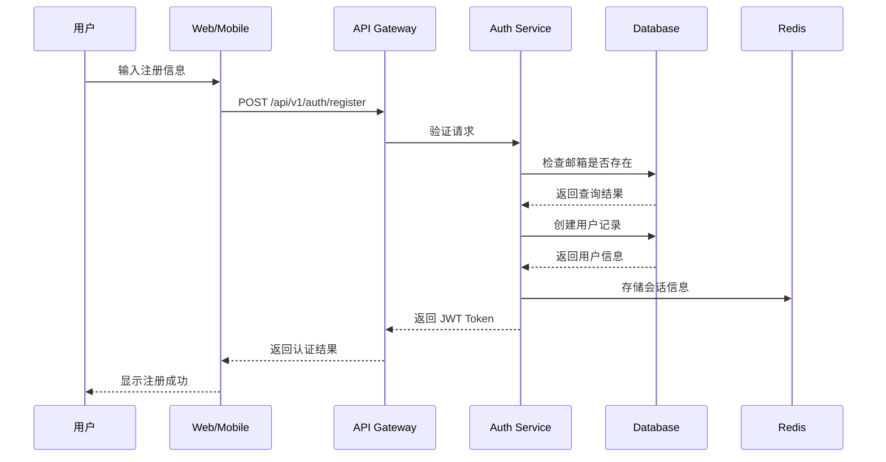
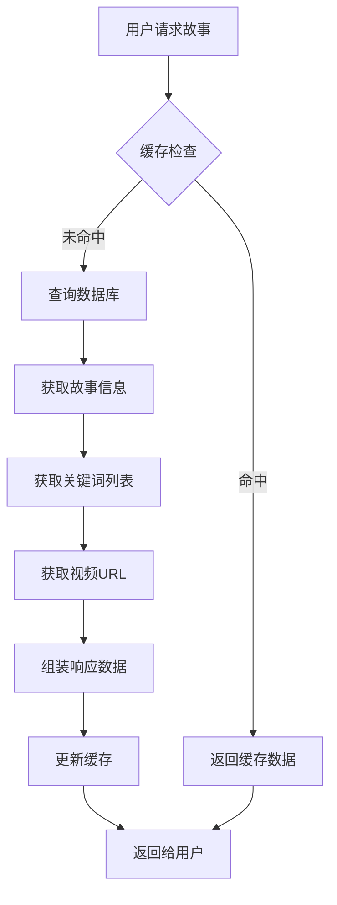
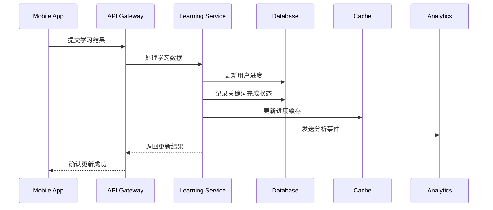
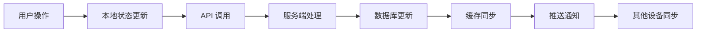
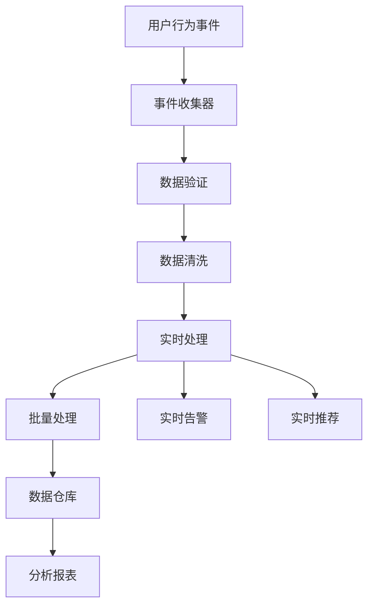
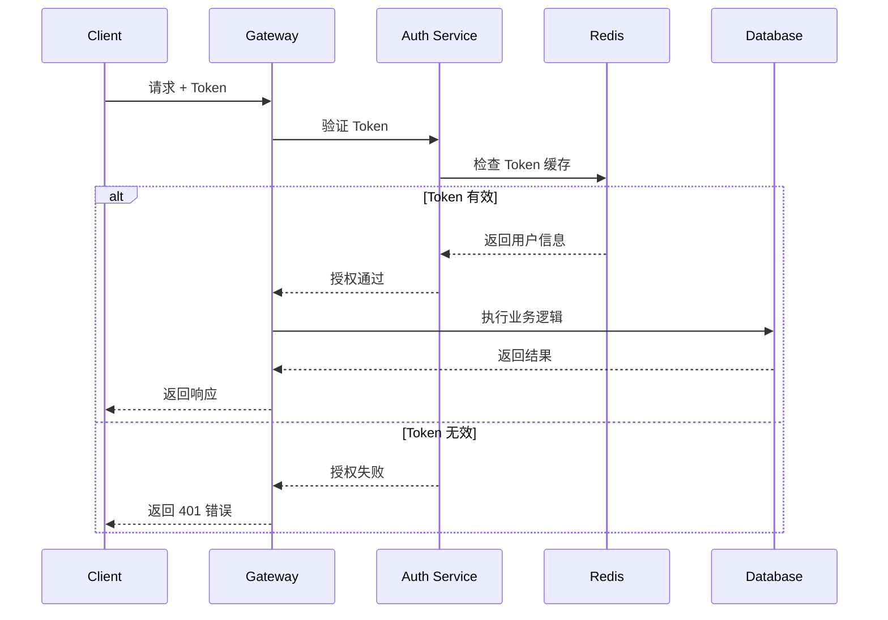
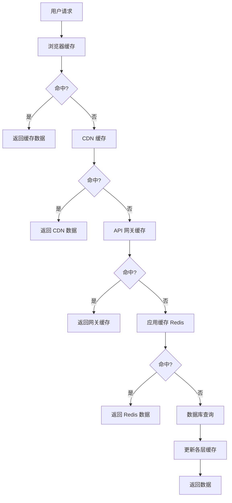
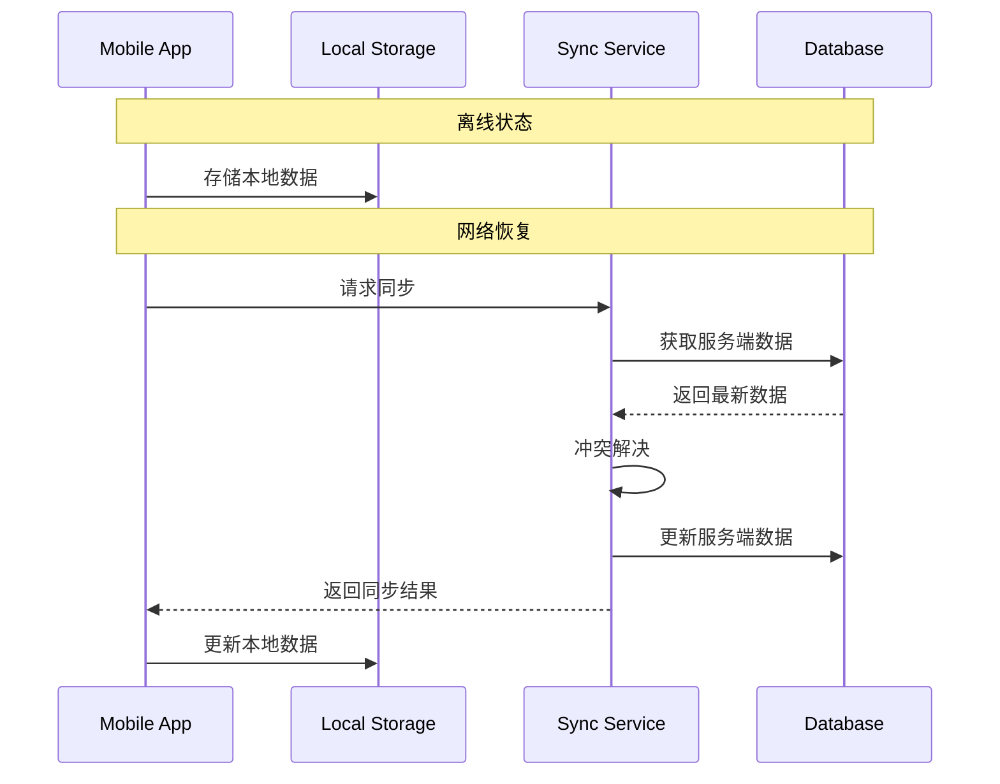

# SmarTalk 数据流图

## 📋 概述

本文档描述了 SmarTalk 系统中各种数据的流向和处理过程，帮助开发者理解系统的数据架构和业务流程。

## 🔄 核心数据流

### 1. 用户注册和认证流程



### 2. 故事内容加载流程



### 3. 学习进度更新流程



## 📊 数据存储流

### 1. 用户数据存储

```
用户输入数据
    ↓
输入验证和清洗
    ↓
业务逻辑处理
    ↓
数据库事务操作
    ↓
缓存更新
    ↓
事件发布 (可选)
```

#### 用户数据表结构
```sql
-- 用户基础信息
users
├── id (UUID)
├── email (唯一)
├── password_hash
├── created_at
└── updated_at

-- 用户资料
user_profiles
├── user_id (外键)
├── first_name
├── last_name
├── avatar_url
├── interests (JSON)
└── level
```

### 2. 内容数据存储

```
内容创建/更新
    ↓
内容验证
    ↓
媒体文件处理
    ↓
数据库存储
    ↓
CDN 分发
    ↓
缓存预热
```

#### 内容数据表结构
```sql
-- 故事内容
stories
├── id (UUID)
├── title
├── description
├── interest
├── difficulty
├── published
└── metadata (JSON)

-- 关键词
keywords
├── id (UUID)
├── story_id (外键)
├── word
├── pronunciation
├── meaning
├── difficulty
└── order

-- 视频内容
videos
├── id (UUID)
├── keyword_id (外键)
├── url
├── type
├── duration
└── order
```

### 3. 学习数据存储

```
学习行为数据
    ↓
实时处理
    ↓
进度计算
    ↓
数据库更新
    ↓
缓存同步
    ↓
分析数据收集
```

#### 学习数据表结构
```sql
-- 用户学习进度
user_progress
├── id (UUID)
├── user_id (外键)
├── story_id (外键)
├── completed
├── completed_keywords
├── total_keywords
├── accuracy
├── time_spent
├── started_at
└── completed_at

-- 关键词学习记录
user_keyword_progress
├── id (UUID)
├── user_id (外键)
├── keyword_id (外键)
├── correct_attempts
├── total_attempts
├── last_attempt_at
└── mastery_level
```

## 🔄 实时数据流

### 1. 学习状态同步



### 2. 性能监控数据流

```
应用性能指标
    ↓
监控中间件收集
    ↓
指标聚合处理
    ↓
时序数据库存储
    ↓
实时告警检查
    ↓
监控面板展示
```

## 📈 分析数据流

### 1. 用户行为分析



### 2. 学习效果分析

```
学习行为数据
    ↓
特征提取
    ↓
模式识别
    ↓
效果评估
    ↓
个性化推荐
    ↓
学习路径优化
```

## 🔐 安全数据流

### 1. 认证授权流程



### 2. 数据加密流程

```
敏感数据输入
    ↓
客户端预处理
    ↓
HTTPS 传输加密
    ↓
服务端接收
    ↓
应用层加密
    ↓
数据库存储
```

## 🚀 缓存数据流

### 1. 多层缓存架构



### 2. 缓存更新策略

```
数据变更事件
    ↓
缓存失效检查
    ↓
相关缓存清理
    ↓
新数据预热
    ↓
缓存一致性验证
```

## 📱 移动端数据同步

### 1. 离线数据同步



### 2. 增量数据更新

```
检查本地版本
    ↓
请求增量数据
    ↓
服务端计算差异
    ↓
返回增量更新
    ↓
本地数据合并
    ↓
版本号更新
```

## 🔍 数据质量保证

### 1. 数据验证流程

```
输入数据
    ↓
格式验证
    ↓
业务规则验证
    ↓
重复性检查
    ↓
完整性验证
    ↓
存储/拒绝
```

### 2. 数据一致性检查

```
定期一致性检查
    ↓
跨系统数据对比
    ↓
不一致数据识别
    ↓
自动修复/人工介入
    ↓
修复结果验证
```

## 📊 数据监控指标

### 关键指标
- **数据吞吐量**: 每秒处理的数据量
- **数据延迟**: 数据处理的平均延迟
- **数据准确性**: 数据验证通过率
- **缓存命中率**: 各层缓存的命中率
- **同步成功率**: 数据同步的成功率

### 监控告警
- 数据处理延迟超过阈值
- 缓存命中率低于预期
- 数据同步失败率过高
- 数据库连接池耗尽
- 存储空间使用率过高

---

**注意**: 本文档描述的数据流程应与实际系统实现保持一致，并随系统演进及时更新。
