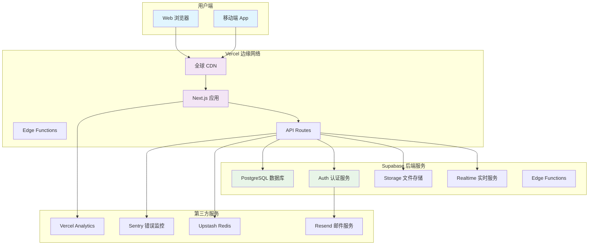

# SmarTalk Vercel + Supabase 完整实施方案

## 🏗️ 技术架构设计

### 整体架构图



### 核心技术栈

| 层级 | 技术选择 | 版本 | 用途 |
|------|----------|------|------|
| **前端框架** | Next.js | 14+ | React 全栈框架 |
| **部署平台** | Vercel | - | 前端 + Serverless API |
| **数据库** | Supabase PostgreSQL | 15+ | 主数据库 + 认证 |
| **缓存** | Upstash Redis | - | 会话缓存 + 性能优化 |
| **文件存储** | Supabase Storage | - | 媒体文件存储 |
| **邮件服务** | Resend | - | 事务邮件发送 |
| **监控** | Vercel Analytics + Sentry | - | 性能 + 错误监控 |
| **CDN** | Vercel Edge Network | - | 全球内容分发 |

## 🔧 详细配置步骤

### 第一步：Supabase 项目设置

#### 1.1 创建 Supabase 项目
```bash
# 1. 访问 https://supabase.com/dashboard
# 2. 点击 "New Project"
# 3. 选择组织和区域（推荐：Singapore 或 Tokyo）
# 4. 设置项目名称：smartalk-production
# 5. 设置强密码并保存
```

#### 1.2 配置数据库结构
```sql
-- 在 Supabase SQL Editor 中执行
-- 启用必要扩展
CREATE EXTENSION IF NOT EXISTS "uuid-ossp";
CREATE EXTENSION IF NOT EXISTS "pgcrypto";
CREATE EXTENSION IF NOT EXISTS "pg_trgm";

-- 创建枚举类型
CREATE TYPE difficulty_level AS ENUM ('beginner', 'intermediate', 'advanced');
CREATE TYPE progress_status AS ENUM ('not_started', 'in_progress', 'completed');
CREATE TYPE video_type AS ENUM ('context', 'option_a', 'option_b');

-- 用户扩展表
CREATE TABLE user_profiles (
    id UUID PRIMARY KEY REFERENCES auth.users(id) ON DELETE CASCADE,
    email TEXT NOT NULL,
    first_name TEXT NOT NULL,
    last_name TEXT NOT NULL,
    preferred_language TEXT DEFAULT 'en',
    learning_goals TEXT[] DEFAULT '{}',
    avatar_url TEXT,
    timezone TEXT DEFAULT 'UTC',
    created_at TIMESTAMPTZ DEFAULT NOW(),
    updated_at TIMESTAMPTZ DEFAULT NOW()
);

-- 故事表
CREATE TABLE stories (
    id UUID PRIMARY KEY DEFAULT uuid_generate_v4(),
    title TEXT NOT NULL,
    description TEXT NOT NULL,
    category TEXT NOT NULL,
    difficulty difficulty_level NOT NULL,
    duration INTEGER NOT NULL,
    thumbnail_url TEXT,
    video_urls JSONB DEFAULT '{}',
    keywords TEXT[] DEFAULT '{}',
    is_published BOOLEAN DEFAULT false,
    view_count INTEGER DEFAULT 0,
    created_at TIMESTAMPTZ DEFAULT NOW(),
    updated_at TIMESTAMPTZ DEFAULT NOW()
);

-- 用户学习进度表
CREATE TABLE user_progress (
    id UUID PRIMARY KEY DEFAULT uuid_generate_v4(),
    user_id UUID NOT NULL REFERENCES auth.users(id) ON DELETE CASCADE,
    story_id UUID NOT NULL REFERENCES stories(id) ON DELETE CASCADE,
    status progress_status DEFAULT 'not_started',
    score INTEGER CHECK (score >= 0 AND score <= 100),
    time_spent INTEGER DEFAULT 0,
    last_position INTEGER DEFAULT 0,
    completed_at TIMESTAMPTZ,
    created_at TIMESTAMPTZ DEFAULT NOW(),
    updated_at TIMESTAMPTZ DEFAULT NOW(),
    UNIQUE(user_id, story_id)
);

-- 创建索引优化查询性能
CREATE INDEX idx_stories_category ON stories(category);
CREATE INDEX idx_stories_difficulty ON stories(difficulty);
CREATE INDEX idx_stories_published ON stories(is_published);
CREATE INDEX idx_user_progress_user_id ON user_progress(user_id);
CREATE INDEX idx_user_progress_status ON user_progress(status);

-- 创建全文搜索索引
CREATE INDEX idx_stories_search ON stories USING gin(to_tsvector('english', title || ' ' || description));
```

#### 1.3 配置行级安全策略 (RLS)
```sql
-- 启用 RLS
ALTER TABLE user_profiles ENABLE ROW LEVEL SECURITY;
ALTER TABLE user_progress ENABLE ROW LEVEL SECURITY;

-- 用户只能访问自己的数据
CREATE POLICY "Users can view own profile" ON user_profiles
    FOR SELECT USING (auth.uid() = id);

CREATE POLICY "Users can update own profile" ON user_profiles
    FOR UPDATE USING (auth.uid() = id);

CREATE POLICY "Users can view own progress" ON user_progress
    FOR SELECT USING (auth.uid() = user_id);

CREATE POLICY "Users can manage own progress" ON user_progress
    FOR ALL USING (auth.uid() = user_id);

-- 故事对所有认证用户可见
CREATE POLICY "Stories are viewable by authenticated users" ON stories
    FOR SELECT USING (auth.role() = 'authenticated' AND is_published = true);
```

#### 1.4 配置认证设置
```javascript
// 在 Supabase Dashboard > Authentication > Settings
{
  "site_url": "https://smartalk.vercel.app",
  "redirect_urls": [
    "https://smartalk.vercel.app/auth/callback",
    "https://smartalk.vercel.app/auth/reset-password",
    "http://localhost:3000/auth/callback"
  ],
  "jwt_expiry": 3600,
  "refresh_token_rotation_enabled": true,
  "security_update_password_require_reauthentication": true
}
```

### 第二步：Vercel 项目配置

#### 2.1 项目结构优化
```
web/
├── components/
│   ├── auth/           # 认证相关组件
│   ├── learning/       # 学习功能组件
│   └── ui/            # 通用 UI 组件
├── lib/
│   ├── supabase.ts    # Supabase 客户端
│   ├── auth.ts        # 认证工具函数
│   └── utils.ts       # 通用工具函数
├── pages/
│   ├── api/           # API Routes
│   │   ├── auth/      # 认证 API
│   │   ├── stories/   # 故事 API
│   │   └── progress/  # 进度 API
│   ├── auth/          # 认证页面
│   ├── learn/         # 学习页面
│   └── dashboard/     # 用户仪表板
├── styles/
├── public/
└── middleware.ts      # 路由中间件
```

#### 2.2 环境变量配置
```bash
# .env.local (开发环境)
NEXT_PUBLIC_SUPABASE_URL=https://your-project.supabase.co
NEXT_PUBLIC_SUPABASE_ANON_KEY=your-anon-key
SUPABASE_SERVICE_ROLE_KEY=your-service-role-key

# 第三方服务
UPSTASH_REDIS_REST_URL=https://your-redis.upstash.io
UPSTASH_REDIS_REST_TOKEN=your-redis-token
RESEND_API_KEY=re_your-resend-key
SENTRY_DSN=https://your-sentry-dsn

# 应用配置
NEXT_PUBLIC_APP_URL=http://localhost:3000
NEXT_PUBLIC_APP_ENV=development
```

#### 2.3 Vercel 部署配置
```json
// vercel.json
{
  "version": 2,
  "framework": "nextjs",
  "functions": {
    "pages/api/**/*.js": {
      "maxDuration": 30
    },
    "pages/api/**/*.ts": {
      "maxDuration": 30
    }
  },
  "headers": [
    {
      "source": "/(.*)",
      "headers": [
        {
          "key": "X-Content-Type-Options",
          "value": "nosniff"
        },
        {
          "key": "X-Frame-Options",
          "value": "DENY"
        },
        {
          "key": "X-XSS-Protection",
          "value": "1; mode=block"
        },
        {
          "key": "Referrer-Policy",
          "value": "strict-origin-when-cross-origin"
        }
      ]
    }
  ],
  "rewrites": [
    {
      "source": "/api/health",
      "destination": "/api/system/health"
    }
  ],
  "regions": ["hkg1", "sin1", "sfo1", "fra1"]
}
```

### 第三步：核心功能实现

#### 3.1 Supabase 客户端配置
```typescript
// lib/supabase.ts
import { createClient } from '@supabase/supabase-js';
import { createServerClient } from '@supabase/ssr';
import { cookies } from 'next/headers';

const supabaseUrl = process.env.NEXT_PUBLIC_SUPABASE_URL!;
const supabaseAnonKey = process.env.NEXT_PUBLIC_SUPABASE_ANON_KEY!;

// 客户端实例
export const supabase = createClient(supabaseUrl, supabaseAnonKey, {
  auth: {
    persistSession: true,
    autoRefreshToken: true,
    detectSessionInUrl: true
  }
});

// 服务端实例
export const createSupabaseServerClient = () => {
  const cookieStore = cookies();
  
  return createServerClient(supabaseUrl, supabaseAnonKey, {
    cookies: {
      get(name: string) {
        return cookieStore.get(name)?.value;
      },
      set(name: string, value: string, options: any) {
        cookieStore.set({ name, value, ...options });
      },
      remove(name: string, options: any) {
        cookieStore.delete({ name, ...options });
      },
    },
  });
};

// 管理员实例
export const supabaseAdmin = createClient(
  supabaseUrl,
  process.env.SUPABASE_SERVICE_ROLE_KEY!,
  {
    auth: {
      autoRefreshToken: false,
      persistSession: false
    }
  }
);
```

#### 3.2 认证中间件
```typescript
// middleware.ts
import { createMiddlewareClient } from '@supabase/auth-helpers-nextjs';
import { NextResponse } from 'next/server';
import type { NextRequest } from 'next/server';

export async function middleware(req: NextRequest) {
  const res = NextResponse.next();
  const supabase = createMiddlewareClient({ req, res });

  const {
    data: { session },
  } = await supabase.auth.getSession();

  // 保护需要认证的路由
  if (req.nextUrl.pathname.startsWith('/dashboard') || 
      req.nextUrl.pathname.startsWith('/learn')) {
    if (!session) {
      return NextResponse.redirect(new URL('/auth/login', req.url));
    }
  }

  // 已登录用户访问认证页面时重定向
  if (req.nextUrl.pathname.startsWith('/auth') && session) {
    return NextResponse.redirect(new URL('/dashboard', req.url));
  }

  return res;
}

export const config = {
  matcher: [
    '/dashboard/:path*',
    '/learn/:path*',
    '/auth/:path*'
  ]
};
```

#### 3.3 API 路由示例
```typescript
// pages/api/stories/index.ts
import { NextApiRequest, NextApiResponse } from 'next';
import { createSupabaseServerClient } from '../../../lib/supabase';
import { Redis } from '@upstash/redis';

const redis = new Redis({
  url: process.env.UPSTASH_REDIS_REST_URL!,
  token: process.env.UPSTASH_REDIS_REST_TOKEN!,
});

export default async function handler(
  req: NextApiRequest,
  res: NextApiResponse
) {
  if (req.method !== 'GET') {
    return res.status(405).json({ error: 'Method not allowed' });
  }

  try {
    const supabase = createSupabaseServerClient();
    
    // 验证用户认证
    const { data: { user }, error: authError } = await supabase.auth.getUser();
    if (authError || !user) {
      return res.status(401).json({ error: 'Unauthorized' });
    }

    const { category, difficulty, page = 1, limit = 10 } = req.query;
    
    // 尝试从缓存获取
    const cacheKey = `stories:${category}:${difficulty}:${page}:${limit}`;
    const cached = await redis.get(cacheKey);
    
    if (cached) {
      return res.status(200).json(cached);
    }

    // 构建查询
    let query = supabase
      .from('stories')
      .select(`
        id,
        title,
        description,
        category,
        difficulty,
        duration,
        thumbnail_url,
        keywords,
        view_count
      `)
      .eq('is_published', true);

    if (category) query = query.eq('category', category);
    if (difficulty) query = query.eq('difficulty', difficulty);

    const from = (Number(page) - 1) * Number(limit);
    const to = from + Number(limit) - 1;
    
    const { data: stories, error, count } = await query
      .range(from, to)
      .order('created_at', { ascending: false });

    if (error) {
      throw error;
    }

    const result = {
      stories,
      pagination: {
        page: Number(page),
        limit: Number(limit),
        total: count || 0,
        totalPages: Math.ceil((count || 0) / Number(limit))
      }
    };

    // 缓存结果 5 分钟
    await redis.setex(cacheKey, 300, JSON.stringify(result));

    res.status(200).json(result);
  } catch (error) {
    console.error('Stories API error:', error);
    res.status(500).json({ error: 'Internal server error' });
  }
}
```

## 🔒 安全配置最佳实践

### 环境变量安全
```bash
# 生产环境变量（在 Vercel Dashboard 设置）
NEXT_PUBLIC_SUPABASE_URL=https://your-project.supabase.co
NEXT_PUBLIC_SUPABASE_ANON_KEY=eyJ... # 匿名密钥
SUPABASE_SERVICE_ROLE_KEY=eyJ... # 服务角色密钥（敏感）

# 第三方服务密钥
UPSTASH_REDIS_REST_URL=https://...
UPSTASH_REDIS_REST_TOKEN=... # 敏感
RESEND_API_KEY=re_... # 敏感
SENTRY_DSN=https://... # 可公开

# 应用配置
NEXT_PUBLIC_APP_URL=https://smartalk.vercel.app
NEXT_PUBLIC_APP_ENV=production
```

### 数据库安全策略
```sql
-- 创建应用专用角色
CREATE ROLE smartalk_app;
GRANT USAGE ON SCHEMA public TO smartalk_app;
GRANT SELECT, INSERT, UPDATE, DELETE ON ALL TABLES IN SCHEMA public TO smartalk_app;

-- 限制敏感操作
REVOKE ALL ON auth.users FROM smartalk_app;
GRANT SELECT (id, email, created_at) ON auth.users TO smartalk_app;
```

### API 安全配置
```typescript
// lib/security.ts
import rateLimit from 'express-rate-limit';

export const createRateLimiter = (windowMs: number, max: number) => {
  return rateLimit({
    windowMs,
    max,
    message: 'Too many requests from this IP',
    standardHeaders: true,
    legacyHeaders: false,
  });
};

// 不同端点的限制策略
export const rateLimits = {
  auth: createRateLimiter(15 * 60 * 1000, 5), // 15分钟5次
  api: createRateLimiter(60 * 1000, 100), // 1分钟100次
  upload: createRateLimiter(60 * 1000, 10), // 1分钟10次
};
```

## 📊 性能优化策略

### 1. 数据库优化
```sql
-- 创建复合索引
CREATE INDEX idx_stories_category_difficulty ON stories(category, difficulty);
CREATE INDEX idx_user_progress_user_story ON user_progress(user_id, story_id);

-- 创建部分索引
CREATE INDEX idx_published_stories ON stories(created_at) WHERE is_published = true;

-- 优化查询性能
ANALYZE stories;
ANALYZE user_progress;
```

### 2. 缓存策略
```typescript
// lib/cache.ts
import { Redis } from '@upstash/redis';

const redis = new Redis({
  url: process.env.UPSTASH_REDIS_REST_URL!,
  token: process.env.UPSTASH_REDIS_REST_TOKEN!,
});

export const cacheStrategies = {
  // 故事列表缓存 5 分钟
  stories: {
    ttl: 300,
    key: (params: any) => `stories:${JSON.stringify(params)}`,
  },
  
  // 用户进度缓存 1 分钟
  progress: {
    ttl: 60,
    key: (userId: string) => `progress:${userId}`,
  },
  
  // 用户资料缓存 10 分钟
  profile: {
    ttl: 600,
    key: (userId: string) => `profile:${userId}`,
  },
};

export const withCache = async <T>(
  key: string,
  ttl: number,
  fetcher: () => Promise<T>
): Promise<T> => {
  const cached = await redis.get(key);
  if (cached) return cached as T;
  
  const data = await fetcher();
  await redis.setex(key, ttl, JSON.stringify(data));
  return data;
};
```

### 3. 前端优化
```typescript
// components/OptimizedImage.tsx
import Image from 'next/image';
import { useState } from 'react';

interface OptimizedImageProps {
  src: string;
  alt: string;
  width: number;
  height: number;
  priority?: boolean;
}

export const OptimizedImage: React.FC<OptimizedImageProps> = ({
  src,
  alt,
  width,
  height,
  priority = false
}) => {
  const [isLoading, setIsLoading] = useState(true);

  return (
    <div className="relative overflow-hidden">
      <Image
        src={src}
        alt={alt}
        width={width}
        height={height}
        priority={priority}
        className={`transition-opacity duration-300 ${
          isLoading ? 'opacity-0' : 'opacity-100'
        }`}
        onLoadingComplete={() => setIsLoading(false)}
        placeholder="blur"
        blurDataURL="data:image/jpeg;base64,/9j/4AAQSkZJRgABAQAAAQABAAD/2wBDAAYEBQYFBAYGBQYHBwYIChAKCgkJChQODwwQFxQYGBcUFhYaHSUfGhsjHBYWICwgIyYnKSopGR8tMC0oMCUoKSj/2wBDAQcHBwoIChMKChMoGhYaKCgoKCgoKCgoKCgoKCgoKCgoKCgoKCgoKCgoKCgoKCgoKCgoKCgoKCgoKCgoKCgoKCj/wAARCAABAAEDASIAAhEBAxEB/8QAFQABAQAAAAAAAAAAAAAAAAAAAAv/xAAUEAEAAAAAAAAAAAAAAAAAAAAA/8QAFQEBAQAAAAAAAAAAAAAAAAAAAAX/xAAUEQEAAAAAAAAAAAAAAAAAAAAA/9oADAMBAAIRAxEAPwCdABmX/9k="
      />
      {isLoading && (
        <div className="absolute inset-0 bg-gray-200 animate-pulse" />
      )}
    </div>
  );
};
```

## 📈 监控和维护

### 1. 错误监控配置
```typescript
// lib/monitoring.ts
import * as Sentry from '@sentry/nextjs';

Sentry.init({
  dsn: process.env.SENTRY_DSN,
  environment: process.env.NEXT_PUBLIC_APP_ENV,
  tracesSampleRate: 0.1,
  beforeSend(event) {
    // 过滤敏感信息
    if (event.request?.headers) {
      delete event.request.headers.authorization;
      delete event.request.headers.cookie;
    }
    return event;
  },
});

export const captureError = (error: Error, context?: any) => {
  Sentry.captureException(error, {
    contexts: { additional: context },
  });
};
```

### 2. 性能监控
```typescript
// lib/analytics.ts
import { Analytics } from '@vercel/analytics/react';

export const trackEvent = (name: string, properties?: Record<string, any>) => {
  if (typeof window !== 'undefined') {
    // Vercel Analytics
    window.va?.track(name, properties);
    
    // 自定义分析
    fetch('/api/analytics/track', {
      method: 'POST',
      headers: { 'Content-Type': 'application/json' },
      body: JSON.stringify({ event: name, properties }),
    }).catch(console.error);
  }
};

// 使用示例
export const trackLearningEvent = (storyId: string, action: string) => {
  trackEvent('learning_action', {
    story_id: storyId,
    action,
    timestamp: new Date().toISOString(),
  });
};
```

### 3. 健康检查端点
```typescript
// pages/api/system/health.ts
import { NextApiRequest, NextApiResponse } from 'next/server';
import { createSupabaseServerClient } from '../../../lib/supabase';
import { Redis } from '@upstash/redis';

export default async function handler(
  req: NextApiRequest,
  res: NextApiResponse
) {
  const checks = {
    database: false,
    redis: false,
    timestamp: new Date().toISOString(),
  };

  try {
    // 检查数据库连接
    const supabase = createSupabaseServerClient();
    const { error: dbError } = await supabase
      .from('stories')
      .select('id')
      .limit(1);
    
    checks.database = !dbError;

    // 检查 Redis 连接
    const redis = new Redis({
      url: process.env.UPSTASH_REDIS_REST_URL!,
      token: process.env.UPSTASH_REDIS_REST_TOKEN!,
    });
    
    await redis.ping();
    checks.redis = true;

    const isHealthy = checks.database && checks.redis;
    
    res.status(isHealthy ? 200 : 503).json({
      status: isHealthy ? 'healthy' : 'unhealthy',
      checks,
    });
  } catch (error) {
    res.status(503).json({
      status: 'unhealthy',
      checks,
      error: error instanceof Error ? error.message : 'Unknown error',
    });
  }
}
```

## 💰 成本估算和扩展建议

### 免费额度使用情况
| 服务 | 免费额度 | 预估使用量 | 成本 |
|------|----------|------------|------|
| Vercel | 100GB 带宽 | ~20GB/月 | $0 |
| Supabase | 500MB 数据库 | ~200MB | $0 |
| Upstash Redis | 10K 请求/天 | ~5K/天 | $0 |
| Resend | 3K 邮件/月 | ~500/月 | $0 |
| **总计** | - | - | **$0/月** |

### 扩展阶段成本预估
| 用户规模 | 月活用户 | 预估成本 | 主要费用 |
|----------|----------|----------|----------|
| 小规模 | 1K-5K | $25-50 | Supabase Pro |
| 中规模 | 5K-20K | $100-200 | Vercel Pro + Supabase |
| 大规模 | 20K+ | $500+ | 企业级服务 |

### 扩展建议
1. **数据库优化**: 使用只读副本分离读写操作
2. **CDN 优化**: 启用 Vercel Edge Functions
3. **缓存策略**: 增加 Redis 缓存层
4. **监控升级**: 使用专业监控服务
5. **备份策略**: 实施自动备份和灾难恢复

---

**下一步**: 运行一键部署脚本开始实施！
