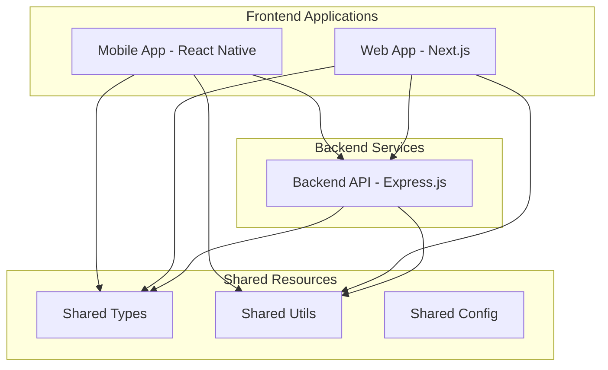
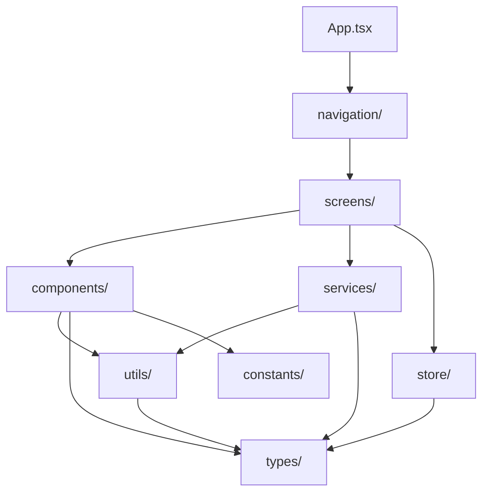
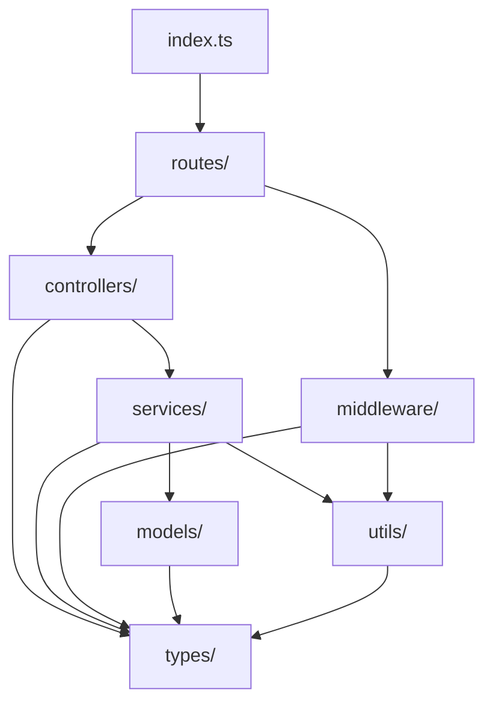

# SmarTalk 模块依赖关系图

## 📋 概述

本文档描述了 SmarTalk MVP 项目中各模块之间的依赖关系，帮助开发者理解代码架构和导入路径。

## 🏗️ 整体架构



## 📱 移动端模块依赖

### 核心层级结构
```
mobile/src/
├── App.tsx                 # 应用入口
├── navigation/             # 导航配置
├── screens/                # 页面组件
├── components/             # 可复用组件
├── services/               # 业务服务
├── store/                  # 状态管理
├── utils/                  # 工具函数
├── types/                  # 类型定义
├── constants/              # 常量定义
└── assets/                 # 静态资源
```

### 依赖关系


### 路径别名映射
| 别名 | 实际路径 | 用途 |
|------|----------|------|
| `@/*` | `src/*` | 根目录访问 |
| `@/components/*` | `src/components/*` | 组件导入 |
| `@/screens/*` | `src/screens/*` | 页面导入 |
| `@/services/*` | `src/services/*` | 服务导入 |
| `@/utils/*` | `src/utils/*` | 工具函数导入 |
| `@/types/*` | `src/types/*` | 类型定义导入 |
| `@/constants/*` | `src/constants/*` | 常量导入 |
| `@/store/*` | `src/store/*` | 状态管理导入 |
| `@/navigation/*` | `src/navigation/*` | 导航导入 |
| `@/assets/*` | `src/assets/*` | 资源导入 |
| `@/shared/*` | `../shared/*` | 共享模块导入 |

## 🖥️ 后端模块依赖

### 核心层级结构
```
backend/src/
├── index.ts                # 应用入口
├── routes/                 # 路由定义
├── controllers/            # 控制器
├── services/               # 业务服务
├── middleware/             # 中间件
├── models/                 # 数据模型
├── utils/                  # 工具函数
├── types/                  # 类型定义
├── config/                 # 配置文件
└── scripts/                # 脚本文件
```

### 依赖关系


### 路径别名映射
| 别名 | 实际路径 | 用途 |
|------|----------|------|
| `@/*` | `src/*` | 根目录访问 |
| `@/controllers/*` | `src/controllers/*` | 控制器导入 |
| `@/services/*` | `src/services/*` | 服务导入 |
| `@/routes/*` | `src/routes/*` | 路由导入 |
| `@/middleware/*` | `src/middleware/*` | 中间件导入 |
| `@/models/*` | `src/models/*` | 模型导入 |
| `@/utils/*` | `src/utils/*` | 工具函数导入 |
| `@/types/*` | `src/types/*` | 类型定义导入 |
| `@/config/*` | `src/config/*` | 配置导入 |
| `@/shared/*` | `../shared/*` | 共享模块导入 |

## 🌐 Web端模块依赖

### 核心层级结构
```
web/src/
├── app/                    # Next.js App Router
├── components/             # 可复用组件
├── lib/                    # 库函数
├── hooks/                  # React Hooks
├── store/                  # 状态管理
├── types/                  # 类型定义
└── data/                   # 静态数据
```

### 路径别名映射
| 别名 | 实际路径 | 用途 |
|------|----------|------|
| `@/*` | `src/*` | 根目录访问 |
| `@/components/*` | `src/components/*` | 组件导入 |
| `@/app/*` | `src/app/*` | 应用路由导入 |
| `@/lib/*` | `src/lib/*` | 库函数导入 |
| `@/hooks/*` | `src/hooks/*` | Hooks导入 |
| `@/types/*` | `src/types/*` | 类型定义导入 |
| `@/store/*` | `src/store/*` | 状态管理导入 |
| `@/shared/*` | `../shared/*` | 共享模块导入 |

## 🔗 跨模块依赖

### 共享模块
```
shared/
├── types/                  # 跨平台类型定义
├── utils/                  # 跨平台工具函数
├── constants/              # 跨平台常量
└── config/                 # 跨平台配置
```

### 依赖规则
1. **单向依赖**：上层模块可以依赖下层模块，反之不可
2. **同层隔离**：同层级模块之间避免直接依赖
3. **共享优先**：优先使用共享模块中的通用功能
4. **类型安全**：所有跨模块调用必须有明确的类型定义

## 🛠️ 导入最佳实践

### 导入顺序
```typescript
// 1. 第三方库
import React from 'react';
import { View, Text } from 'react-native';

// 2. 内部模块（按字母顺序）
import { ApiService } from '@/services/ApiService';
import { VideoPlayer } from '@/components/video/VideoPlayer';
import { useAppStore } from '@/store/useAppStore';

// 3. 类型导入
import type { VideoPlayerProps } from '@/types/video.types';

// 4. 相对导入（如果必要）
import './ComponentName.styles.css';
```

### 避免的模式
```typescript
// ❌ 避免：深层相对导入
import { utils } from '../../../utils/helpers';

// ✅ 推荐：使用别名
import { utils } from '@/utils/helpers';

// ❌ 避免：循环依赖
// A.ts imports B.ts, B.ts imports A.ts

// ✅ 推荐：提取共同依赖到第三个模块
```

## 📊 依赖分析工具

### 检查脚本
- `scripts/analyze-dependencies.js` - 分析模块依赖关系
- `scripts/check-circular-deps.js` - 检查循环依赖
- `scripts/validate-imports.js` - 验证导入路径

### 使用方法
```bash
# 分析依赖关系
npm run analyze:deps

# 检查循环依赖
npm run check:circular

# 验证导入路径
npm run validate:imports
```

---

**最后更新**: 2024-01-19
**维护者**: SmarTalk 技术团队
